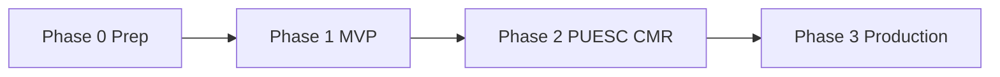
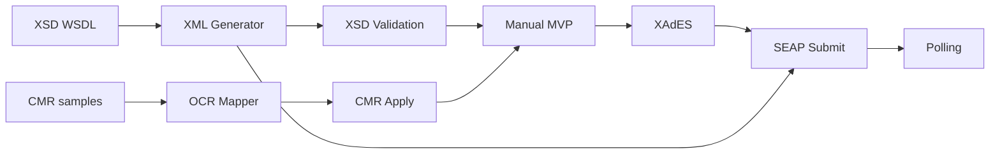

# План реализации программного продукта RMPD

Пошаговый план разработки системы регистрации и сопровождения **RMPD100** с автозаполнением по **CMR**.

**Связанные документы:** [product-specification.md](product-specification.md) · [architecture.md](architecture.md) · [rmpd100.md](rmpd100.md) · [puesc-api.md](puesc-api.md)

**Стек:** Angular · Spring Boot · MySQL · Docker

**Оценка сроков:** ~20–24 недели (1 backend + 1 frontend + part-time QA/DevOps)

---

## 1. Цели и результаты по фазам

| Фаза | Срок | Результат для пользователя |
|------|------|----------------------------|
| **0. Подготовка** | 1–2 нед. | Репозиторий, CI, XSD/WSDL, тестовый доступ PUESC |
| **1. MVP** | 8–10 нед. | Черновик RMPD100, XML, ручная подача на test.puesc |
| **2. PUESC + CMR** | 6–8 нед. | Автоотправка, статусы, OCR CMR |
| **3. Production** | 4–6 нед. | Prod PUESC, мониторинг, актуализация RMPD |
| **4. Расширения** | по запросу | RMPD406, пакетный CMR, агентская модель |

Временная шкала (слева направо):



---

## 2. Команда и зоны ответственности

| Роль | Зона | Ключевые артефакты |
|------|------|-------------------|
| **Backend-разработчик** | Spring Boot, MySQL, PUESC SOAP, XML/XSD, OCR-адаптер | API, миграции Flyway, интеграционные тесты |
| **Frontend-разработчик** | Angular Material, формы, i18n | Мастер RMPD100, CMR UI, справочники |
| **QA** | Сценарии, регрессия XML, test.puesc | Чек-листы, тестовые CMR, отчёты |
| **DevOps** (part-time) | Docker, CI/CD, staging/prod | docker-compose, pipeline, backup |
| **Аналитик / владелец продукта** | Приёмка, доступы PUESC, образцы CMR | Критерии приёмки, UAT |

---

## 3. Фаза 0 — Подготовка (недели 1–2)

### 3.1. Задачи

| # | Задача | Исполнитель | Результат |
|---|--------|-------------|-----------|
| 0.1 | Скачать `RMPD_v20.11.2024` и SEAP WSDL → `specs/` | Backend | XSD/WSDL в проекте |
| 0.2 | Зарегистрировать тестовый аккаунт PUESC | Аналитик | Credentials для dev/stage |
| 0.3 | Scaffold монорепозитория (`frontend/`, `backend/`, `deploy/`) | Backend + FE | Сборка `mvn` + `ng build` |
| 0.4 | Docker Compose: MySQL 8, backend, frontend (dev) | DevOps | `docker compose up` |
| 0.5 | CI: lint, unit-тесты, сборка образов | DevOps | GitHub Actions / GitLab CI |
| 0.6 | Собрать 20+ образцов CMR (сканы разного качества) | Аналитик | Папка `testdata/cmr/` (вне git) |
| 0.7 | OpenAPI skeleton `/api/v1` | Backend | Swagger UI на `/swagger-ui` |

### 3.2. Структура backend (создать в 0.3)

```
backend/
├── pom.xml                    # parent POM
├── rmpd-domain/
├── rmpd-application/
├── rmpd-infrastructure/
├── rmpd-api/
└── rmpd-app/                  # Spring Boot entry point
```

**Зависимости Maven (ключевые):** Spring Boot 3.x, Spring Security, Spring Data JPA, Flyway, springdoc-openapi, EU DSS (позже), Azure Document Intelligence SDK (фаза 2).

### 3.3. Критерий завершения фазы 0

- [ ] `docker compose up` поднимает MySQL + backend healthcheck OK
- [ ] Angular открывается, прокси на `/api/v1`
- [ ] XSD из PUESC валидирует пример XML (ручной тест)
- [ ] CI зелёный на main

---

## 4. Фаза 1 — MVP (недели 3–12)

**Цель:** диспетчер заполняет RMPD100 в веб-форме, скачивает валидный XML и вручную загружает на test.puesc.gov.pl.

### 4.1. Спринт 1 (нед. 3–4) — Auth и справочники

| Backend | Frontend |
|---------|----------|
| Flyway: `carrier`, `user`, `vehicle`, `permit`, `party` | Login, layout (sidenav + toolbar) |
| JWT auth + refresh, роли ADMIN/DISPATCHER/VIEWER | AuthGuard, JwtInterceptor |
| CRUD `/vehicles`, `/permits`, `/parties` | Страницы справочников (mat-table + dialog) |
| Профиль перевозчика `GET/PUT /settings/carrier` | Форма профиля перевозчика |
| Multi-tenant filter по `carrier_id` | — |

**Deliverable:** пользователь логинится, настраивает профиль перевозчика и справочники ТС/разрешений.

### 4.2. Спринт 2 (нед. 5–6) — Декларации CRUD

| Backend | Frontend |
|---------|----------|
| Flyway: `declaration`, `declaration_event` | Список деклараций (mat-table, фильтры) |
| `POST/GET/PUT /declarations` | Кнопка «Новая декларация» |
| Статус `draft`, автосохранение (updated_at) | Мастер stepper: шаг 1–2 (перевозчик, ТС) |
| Валидация латиницы (domain) | LatinInputValidator, подсказки GPS |

**Deliverable:** черновик декларации создаётся и сохраняется.

### 4.3. Спринт 3 (нед. 7–8) — Мастер RMPD100 (полный)

| Backend | Frontend |
|---------|----------|
| Полная модель declaration (маршрут, parties, JSON route_points) | Шаги 3–6: разрешение, маршрут, груз, подтверждение |
| Условная логика в domain (laden/empty/transit/cabotage) | Скрытие Nadawca/Odbiorca при порожнем рейсе |
| `GET /dictionaries/{type}` — статический импорт стран | CountrySelect из API |
| Прогресс заполнения (% обязательных полей) | Индикатор прогресса в stepper |

**Deliverable:** все поля RMPD100 заполняются через UI согласно [rmpd100.md](rmpd100.md).

### 4.4. Спринт 4 (нед. 9–10) — XML и валидация

| Backend | Frontend |
|---------|----------|
| JAXB-модели из XSD (или ручной маппинг DTO → XML) | Предпросмотр XML (readonly textarea) |
| `XmlGenerator` + `XsdValidator` | Кнопка «Проверить» → `POST /validate` |
| `GET /declarations/{id}/xml` — скачивание | Кнопка «Скачать XML» |
| Unit-тесты: эталонный XML ↔ XSD | Сообщения об ошибках валидации |
| `POST /declarations/{id}/copy` | «Создать копию» |

**Deliverable:** XML проходит XSD `RMPD_v20.11.2024`; ручная загрузка на test.puesc успешна (UAT).

### 4.5. Спринт 5 (нед. 11–12) — Полировка MVP

| Задача | Описание |
|--------|----------|
| i18n | PL / UK / EN (ngx-translate) |
| Автосохранение | Debounce 30 с + при смене шага |
| Обработка ошибок | Global error handler, snackbar |
| E2E smoke | Login → создать декларацию → скачать XML |
| Документация | README: как запустить локально |

### 4.6. Критерии приёмки MVP (фаза 1)

1. Декларация создаётся через мастер, статус `draft` / `validated`.
2. XML валиден по XSD; все текстовые поля — латиница.
3. Ручная подача XML на test.puesc.gov.pl — успех (зафиксировать в UAT-отчёте).
4. Multi-tenant: пользователь видит только декларации своего `carrier_id`.
5. Справочники ТС и разрешений подставляются в форму.

---

## 5. Фаза 2 — PUESC + CMR (недели 13–20)

**Цель:** автоматическая отправка в PUESC, отслеживание статуса, автозаполнение из CMR.

### 5.1. Спринт 6 (нед. 13–14) — SEAP SOAP (test)

| Backend | Frontend |
|---------|----------|
| Генерация SOAP-клиента из `WS_PULL.wsdl` | Страница настроек PUESC |
| WS-Security PasswordDigest | Форма credentials (маскирование пароля) |
| `PuescSoapClient`: AcceptDocument (mock → test) | `POST /settings/puesc/test` — индикатор |
| Flyway: `puesc_credential` (AES-256-GCM) | Окружение test/prod (readonly в UI) |
| Логирование sysRef (без паролей) | — |

**Deliverable:** тестовое соединение с te-ws.puesc.gov.pl OK.

### 5.2. Спринт 7 (нед. 15–16) — Submit и polling

| Backend | Frontend |
|---------|----------|
| `POST /declarations/{id}/submit` | Кнопка «Отправить в PUESC» |
| XAdES-BES подпись (EU DSS + P12) | Прогресс отправки (stepper/dialog) |
| `@Scheduled` polling GetNextDocument | Экран статуса: sysRef, timeline событий |
| Парсинг UPP → UPO → RMPD_RESPONSE | Polling статуса с FE (interval 10 с) |
| `declaration_event` для каждого этапа | Отображение reference_number |

**Deliverable:** end-to-end на test PUESC: submit → registered (референсный номер).

### 5.3. Спринт 8 (нед. 17–18) — CMR OCR

| Backend | Frontend |
|---------|----------|
| `OcrService` port + `AzureDocumentIntelligenceOcrService` | Drag-and-drop загрузка CMR |
| Flyway: `cmr_document` | Side-by-side: скан + распознанные поля |
| `CmrFieldMapper` (поля 1–24 → RMPD) | Confidence chips (warn < 70%) |
| ICU4J транслитерация | Чекбоксы «применить поле» |
| `POST /cmr/upload`, `POST /cmr/apply` | Не перезаписывать без подтверждения |
| File storage `/data/cmr` | — |

**OCR — порядок внедрения:**

1. Azure Document Intelligence `prebuilt-layout` (быстрый старт).
2. Замер точности на 20 образцах CMR (ground truth).
3. При accuracy < 80% — custom model на своих CMR.

**Deliverable:** загрузка CMR предзаполняет ≥ 5 полей; пользователь правит и применяет.

### 5.4. Спринт 9 (нед. 19–20) — Уведомления и стабилизация

| Задача | Описание |
|--------|----------|
| Email при `registered` | Spring Mail + шаблон PL/UK |
| Rate limiting | Bucket4j на `/cmr/upload`, `/submit` |
| Retry SOAP | Exponential backoff, idempotency по declaration_id |
| Интеграционные тесты | Mock SEAP + реальный test (manual gate) |
| Регрессия CMR | Метрики accuracy по testdata |

### 5.5. Критерии приёмки фазы 2

1. Декларация отправляется в test PUESC без ручной загрузки XML.
2. Статус обновляется до `registered`, референсный номер сохранён.
3. CMR → автозаполнение ≥ 5 полей, транслитерация кириллицы.
4. История событий (`declaration_event`) полная и просматриваема.
5. Email-уведомление при успешной регистрации.

---

## 6. Фаза 3 — Production (недели 21–24)

### 6.1. Задачи

| # | Задача | Неделя |
|---|--------|--------|
| 3.1 | Переключение на prod WSDL, smoke-тест с реальным cert | 21 |
| 3.2 | Scheduled sync словарей PUESC → `dictionary_cache` | 21 |
| 3.3 | Форма RMPD (актуализация) — базовый сценарий | 22 |
| 3.4 | Мониторинг: Actuator + Prometheus, алерт B010 | 22 |
| 3.5 | Backup MySQL (ежедневно, retention 30 дней) | 23 |
| 3.6 | Аудит действий пользователя | 23 |
| 3.7 | UAT на staging, security review | 24 |
| 3.8 | Runbook: аварийная подача (awaria@gitd) | 24 |

### 6.2. Критерии приёмки production

- [ ] Успешная регистрация RMPD100 в prod PUESC (пилотный перевозчик).
- [ ] Healthcheck и метрики в дашборде.
- [ ] Backup восстанавливается (тест restore).
- [ ] Словари стран/типов ID актуальны (< 7 дней).

---

## 7. Фаза 4 — Расширения (backlog)

| Приоритет | Функция | Оценка |
|-----------|---------|--------|
| P1 | RMPD406 — проверка GPS | 3–4 нед. |
| P2 | Пакетная загрузка CMR | 2 нед. |
| P3 | Справочник контрагентов с автоподсказкой из CMR | 2 нед. |
| P4 | Агентская модель (idSiscROP) | 4+ нед. |
| P5 | Интеграция GPS-провайдеров | TBD |

---

## 8. Зависимости (критический путь)



**Блокеры до старта фазы 2:**

- Тестовый аккаунт PUESC и сертификат подписи.
- Успешная ручная подача XML (доказательство корректности генератора).

**Блокеры до CMR:**

- Минимум 20 образцов CMR для оценки OCR.
- Выбор OCR-провайдера (рекомендация: Azure Document Intelligence).

---

## 9. Миграции БД (порядок Flyway)

| Версия | Таблицы | Фаза |
|--------|---------|------|
| V1 | `carrier`, `user` | 1 |
| V2 | `vehicle`, `permit`, `party` | 1 |
| V3 | `declaration`, `declaration_event` | 1 |
| V4 | `dictionary_cache` | 1 (статический seed) |
| V5 | `puesc_credential` | 2 |
| V6 | `cmr_document` | 2 |
| V7 | `audit_log` | 3 |

---

## 10. Тестирование

| Уровень | Что покрывать | Когда |
|---------|---------------|-------|
| **Unit** | XmlGenerator, XsdValidator, CmrFieldMapper, transliteration | Каждый спринт |
| **Integration** | JPA repos, PuescSoapClient (WireMock) | Спринт 6+ |
| **API** | REST contract (MockMvc / RestAssured) | Спринт 2+ |
| **E2E** | Login → декларация → XML; Login → CMR → apply | Спринт 5, 8 |
| **UAT** | test.puesc.gov.pl, реальные CMR | Конец фаз 1, 2 |
| **Regression XML** | Набор эталонных деклараций ↔ XSD | Перед каждым релизом |

**Эталонные тест-кейсы XML:** сохранять в `backend/rmpd-app/src/test/resources/xml-samples/` (без персональных данных).

---

## 11. Окружения и релизы

| Окружение | Ветка | PUESC | Назначение |
|-----------|-------|-------|------------|
| local | feature/* | mock | Разработка |
| dev | develop | test | Интеграция |
| staging | release/* | test | UAT, демо |
| production | main | prod | Боевой |

**Ритм релизов:** 1 релиз в конце каждой фазы + hotfix по необходимости.

---

## 12. Риски и план реагирования

| Риск | Сигнал | Действие |
|------|--------|----------|
| XSD не совпадает с генератором | Ошибка на test.puesc | Приоритет XML; привлечь аналитика |
| XAdES не принимается | NPP от SEAP | Тест DSS; сверка с примерами PUESC |
| OCR < 70% на ключевых полях | Метрики на testdata | Custom model Azure; усилить preprocessing |
| Задержка доступа PUESC | Нет test account | Параллельно MVP без API; ручной XML |
| Один разработчик на backend | Bottleneck | CMR и PUESC не в одном спринте без FE |

---

## 13. Definition of Done (общий)

Задача считается выполненной, если:

- [ ] Код в main/develop, PR прошёл review
- [ ] Unit-тесты написаны для бизнес-логики
- [ ] API задокументирован в OpenAPI (при изменении контракта)
- [ ] Миграция Flyway идемпотентна
- [ ] Нет секретов в git
- [ ] UI на Angular Material, соответствует макету stepper
- [ ] Проверено на local + dev

---

## 14. Ближайшие шаги (старт работ)

| # | Действие | Срок |
|---|----------|------|
| 1 | Скачать XSD/WSDL в `specs/` | День 1–2 |
| 2 | Заявка на test.puesc.gov.pl | День 1–3 |
| 3 | `ng new frontend` + Spring Boot multi-module | Неделя 1 |
| 4 | Docker Compose (MySQL + backend + frontend) | Неделя 1 |
| 5 | Flyway V1–V2, auth skeleton | Неделя 2 |
| 6 | Первый экран: login + справочник ТС | Конец недели 2 |

---

## 15. Метрики успеха продукта

| Метрика | Цель (6 мес. после prod) |
|---------|--------------------------|
| Время создания RMPD100 | < 10 мин (с CMR) vs ~30 мин вручную |
| Доля успешных XSD-валидаций с первой попытки | > 90% |
| Доля успешных submit в PUESC | > 95% |
| Точность OCR (ключевые поля) | > 85% |
| NPS диспетчеров | > 40 |

---

*Версия: 1.0 · Дата: 2025-06-30*
