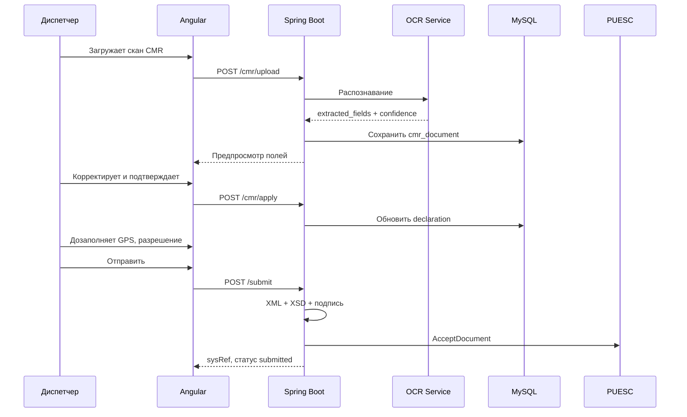
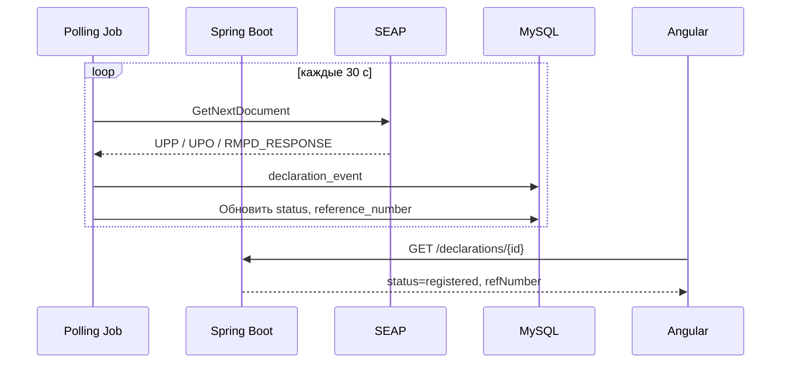

# Спецификация организации программного продукта RMPD

Документ описывает назначение, границы, структуру и организацию разработки системы регистрации и сопровождения уведомлений **RMPD100** с автозаполнением полей по скану **CMR**.

**Связанные документы:**

| Документ | Содержание |
|----------|------------|
| [rmpd100.md](rmpd100.md) | Бизнес-логика формы RMPD100 |
| [puesc-api.md](puesc-api.md) | Интеграция с PUESC/SEAP |
| [architecture.md](architecture.md) | Компоненты и потоки данных |

**Технологический стек (утверждённый):**

| Слой | Технология |
|------|------------|
| Frontend | Angular 19+, Angular Material |
| Backend | Java 21, Spring Boot 3.x |
| БД | MySQL 8.x |
| Очередь задач | Spring `@Scheduled` / Spring Batch (MVP), опционально RabbitMQ |
| Контейнеризация | Docker, Docker Compose |

---

## 1. Назначение и цели продукта

### 1.1. Проблема

Иностранные перевозчики обязаны регистрировать перевозки в польской системе **SENT** через портал **PUESC** (форма **RMPD100**) до начала движения на территории Польши. Ручное заполнение формы трудоёмко, подвержено ошибкам валидации (латиница, коды словарей, формат GPS) и требует знания XSD-спецификации.

### 1.2. Решение

Веб-приложение, которое:

1. **Регистрирует** новые перевозки (RMPD100) — от черновика до получения референсного номера.
2. **Сопровождает** жизненный цикл декларации — статусы, история, повторная отправка, актуализация (RMPD).
3. **Автозаполняет** поля формы по загруженному скану/фото **CMR** (OCR + маппинг в поля RMPD100).
4. **Интегрируется** с PUESC через канал SEAP (SOAP) для автоматической отправки и получения ответов.

### 1.3. Целевая аудитория

| Роль | Потребность |
|------|-------------|
| Диспетчер перевозчика | Быстро создать и отправить RMPD100 |
| Бухгалтер / compliance | Аудит, архив деклараций, отчёты |
| Администратор компании | Настройка PUESC-credentials, справочники ТС |
| Системный администратор | Развёртывание, мониторинг, резервное копирование |

### 1.4. Границы продукта (scope)

**Входит в продукт:**

- CRUD деклараций RMPD100
- Генерация и XSD-валидация XML
- Отправка в PUESC (SEAP) и polling ответов
- OCR CMR → предзаполнение формы
- Мультипользовательский доступ в рамках компании-перевозчика
- Синхронизация словарей PUESC

**Не входит в MVP (последующие фазы):**

- RMPD406 (проверка GPS)
- Интеграция с GPS-провайдерами
- Агентская модель (idSiscROP)
- Мобильное приложение

---

## 2. Функциональные требования

### 2.1. Модуль «Декларации RMPD100»

| ID | Требование | Приоритет |
|----|------------|-----------|
| FR-01 | Создание черновика декларации с пошаговым мастером (stepper) | Must |
| FR-02 | Автосохранение черновика каждые 30 с и при смене шага | Must |
| FR-03 | Условная логика полей (груз/порожний, EU/non-EU, каботаж) | Must |
| FR-04 | Валидация латиницы, форматов GPS, дат, кодов словарей | Must |
| FR-05 | Предпросмотр и скачивание XML | Must |
| FR-06 | XSD-валидация перед подписью/отправкой | Must |
| FR-07 | Отправка в PUESC и отслеживание статуса | Must |
| FR-08 | Хранение референсного номера и истории событий | Must |
| FR-09 | Копирование декларации как шаблон | Should |
| FR-10 | Актуализация через форму RMPD (фаза 3) | Could |

### 2.2. Модуль «CMR — автозаполнение»

| ID | Требование | Приоритет |
|----|------------|-----------|
| FR-20 | Загрузка скана CMR (PDF, JPEG, PNG; до 10 МБ) | Must |
| FR-21 | OCR распознавание текста (латиница + кириллица на входе) | Must |
| FR-22 | Извлечение структурированных полей CMR | Must |
| FR-23 | Маппинг полей CMR → RMPD100 с отображением confidence | Must |
| FR-24 | Ручная корректировка распознанных значений перед применением | Must |
| FR-25 | Транслитерация кириллицы в латиницу для полей RMPD | Must |
| FR-26 | Сохранение исходного файла CMR, привязанного к декларации | Should |
| FR-27 | Пакетная обработка нескольких CMR (фаза 4) | Could |

#### Маппинг CMR → RMPD100

| Поле CMR (типовое) | Поле RMPD100 | Примечание |
|--------------------|--------------|------------|
| Номер CMR | `Numer dokumentu przewozowego` | Прямое соответствие |
| Отправитель (название, адрес) | `Nadawca` — Nazwa, Adres | Транслитерация |
| Получатель (название, адрес) | `Odbiorca` — Nazwa, Adres | Транслитерация |
| Место погрузки | `Kraj załadunku`, точки маршрута | Парсинг страны/города |
| Место выгрузки | `Kraj rozładunku`, точки маршрута | Парсинг страны/города |
| Дата CMR / погрузки | `Data rozpoczęcia przewozu` | Нормализация даты |
| Описание груза | Косвенно — тип перевозки «с грузом» | Флаг, не XML-поле |
| Перевозчик (если указан) | `Przewoźnik` | Сопоставление со справочником |
| Госномер ТС | `Numer rejestracyjny ciągnika` | Regex по шаблону номера |
| Прицеп | `Numer rejestracyjny naczepy` | Опционально |

> Поля разрешения, GPS-локатора и типа zezwolenia **не извлекаются из CMR** — заполняются из справочников компании или вручную.

### 2.3. Модуль «Справочники»

| ID | Требование | Приоритет |
|----|------------|-----------|
| FR-30 | Справочник ТС компании (тягач, прицеп, GPS ID) | Must |
| FR-31 | Справочник разрешений (тип, номер, срок) | Must |
| FR-32 | Профиль перевозчика (идентификатор, адрес, email) | Must |
| FR-33 | Периодическая синхронизация словарей PUESC (страны, типы ID) | Must |
| FR-34 | Справочник контрагентов (отправители/получатели) | Should |

### 2.4. Модуль «Интеграция PUESC»

| ID | Требование | Приоритет |
|----|------------|-----------|
| FR-40 | SOAP-клиент SEAP (AcceptDocument, GetDocuments, GetNextDocument) | Must |
| FR-41 | WS-Security PasswordDigest | Must |
| FR-42 | Асинхронный polling UPP → UPO → бизнес-ответ | Must |
| FR-43 | Хранение sysRef, korelacjaSysref | Must |
| FR-44 | Поддержка test/prod окружений PUESC | Must |
| FR-45 | XAdES-BES enveloped подпись XML | Must (фаза 2) |
| FR-46 | Уведомление пользователя при получении номера (email) | Should |

### 2.5. Модуль «Пользователи и доступ»

| ID | Требование | Приоритет |
|----|------------|-----------|
| FR-50 | Аутентификация (JWT + refresh token) | Must |
| FR-51 | Роли: `ADMIN`, `DISPATCHER`, `VIEWER` | Must |
| FR-52 | Изоляция данных по `carrier_id` (multi-tenant) | Must |
| FR-53 | Аудит действий пользователя | Should |

---

## 3. Нефункциональные требования

| ID | Категория | Требование |
|----|-----------|------------|
| NFR-01 | Производительность | Отклик API < 500 мс (p95), OCR < 30 с на документ |
| NFR-02 | Доступность | 99.5% uptime (prod) |
| NFR-03 | Безопасность | HTTPS, шифрование credentials at rest (AES-256) |
| NFR-04 | Масштабируемость | До 50 одновременных пользователей на инстанс (MVP) |
| NFR-05 | Локализация UI | PL / UK / EN (i18n Angular) |
| NFR-06 | Совместимость | Chrome, Edge, Firefox (последние 2 версии) |
| NFR-07 | Резервирование | Ежедневный backup MySQL, хранение 30 дней |
| NFR-08 | Аудит PUESC | Лог всех SOAP-операций с sysRef (без паролей) |

---

## 4. Организация репозитория и модулей

### 4.1. Структура монорепозитория

```
rmpd/
├── frontend/                    # Angular SPA
│   ├── src/app/
│   │   ├── core/                # Auth, interceptors, guards
│   │   ├── shared/              # Общие компоненты, pipes, validators
│   │   ├── features/
│   │   │   ├── declarations/    # Список, мастер, детали RMPD100
│   │   │   ├── cmr-import/      # Загрузка и предпросмотр OCR
│   │   │   ├── dictionaries/    # ТС, разрешения, контрагенты
│   │   │   └── settings/        # PUESC credentials, профиль
│   │   └── layout/              # Shell, навигация
│   └── angular.json
│
├── backend/                     # Spring Boot multi-module
│   ├── rmpd-api/                # REST controllers, DTO, OpenAPI
│   ├── rmpd-domain/             # Entities, domain services, enums
│   ├── rmpd-infrastructure/     # JPA repos, PUESC client, OCR adapter
│   ├── rmpd-application/        # Use cases, orchestration
│   └── rmpd-app/                # Spring Boot main, config
│
├── specs/                       # XSD, WSDL (не в git — см. specs/README.md)
│   ├── rmpd/
│   └── seap/
│
├── docs/                        # Документация
├── deploy/                      # Docker, docker-compose, k8s (опционально)
│   ├── docker-compose.yml
│   ├── Dockerfile.backend
│   └── Dockerfile.frontend
│
└── README.md
```

### 4.2. Модули backend (Spring Boot)

```
┌─────────────────────────────────────────────────────────────┐
│                      rmpd-api (REST)                        │
│   DeclarationController │ CmrController │ DictionaryCtrl    │
└────────────────────────────┬────────────────────────────────┘
                             │
┌────────────────────────────▼────────────────────────────────┐
│                   rmpd-application (Use Cases)              │
│  CreateDeclaration │ SubmitToPuesc │ ProcessCmrScan         │
│  SyncDictionaries  │ PollPuescResponses                      │
└────────────────────────────┬────────────────────────────────┘
                             │
┌────────────────────────────▼────────────────────────────────┐
│                    rmpd-domain (Core)                       │
│  Declaration │ Carrier │ Vehicle │ CmrExtractionResult     │
│  DeclarationStatus │ Route │ Party │ Permit                  │
└────────────────────────────┬────────────────────────────────┘
                             │
┌────────────────────────────▼────────────────────────────────┐
│              rmpd-infrastructure (Adapters)                 │
│  JPA/MySQL │ PuescSoapClient │ XmlGenerator │ OcrService    │
│  XadesSigner │ DictionarySyncJob │ FileStorage              │
└─────────────────────────────────────────────────────────────┘
```

| Модуль | Ответственность |
|--------|-----------------|
| `rmpd-api` | HTTP-слой, валидация запросов, маппинг DTO ↔ domain |
| `rmpd-application` | Сценарии использования, транзакции, оркестрация |
| `rmpd-domain` | Бизнес-правила, статусы, валидация домена |
| `rmpd-infrastructure` | БД, внешние API, OCR, файловое хранилище |
| `rmpd-app` | `@SpringBootApplication`, security, scheduling, properties |

### 4.3. Модули frontend (Angular)

| Модуль | Экраны / компоненты |
|--------|---------------------|
| `declarations` | Список (mat-table), мастер (mat-stepper), детали, статус отправки |
| `cmr-import` | Drag-and-drop загрузка, preview OCR, diff «было → стало» |
| `dictionaries` | CRUD ТС, разрешений, контрагентов (mat-dialog) |
| `settings` | PUESC credentials, сертификат, профиль перевозчика |
| `core` | AuthGuard, JwtInterceptor, ErrorHandler |
| `shared` | LatinInputValidator, CountrySelect, DateRangeValidator |

---

## 5. Модель данных (MySQL)

### 5.1. ER-диаграмма (основные сущности)

```
┌──────────────┐     ┌──────────────┐     ┌──────────────────┐
│   carrier    │────<│    user      │     │ puesc_credential │
│              │     │              │     │  (encrypted)     │
└──────┬───────┘     └──────────────┘     └──────────────────┘
       │
       ├────< vehicle
       ├────< permit
       ├────< party (sender/receiver)
       │
       └────< declaration ────< declaration_event
                  │
                  ├──── route (embedded / 1:1)
                  ├──── cmr_document (file ref + ocr JSON)
                  └──── generated_xml (versioned)
```

### 5.2. Таблицы

#### `carrier` — перевозчик

| Колонка | Тип | Описание |
|---------|-----|----------|
| id | BIGINT PK | |
| id_type | VARCHAR(20) | INNY / NIP / VAT UE |
| id_number | VARCHAR(50) | ЄДРПОУ и т.д. |
| name | VARCHAR(255) | Латиница |
| address_json | JSON | Структурированный адрес |
| email | VARCHAR(255) | |
| created_at | TIMESTAMP | |

#### `declaration` — декларация RMPD100

| Колонка | Тип | Описание |
|---------|-----|----------|
| id | BIGINT PK | |
| carrier_id | BIGINT FK | |
| created_by | BIGINT FK → user | |
| status | ENUM | draft → registered / rejected / error |
| transport_type | VARCHAR(30) | laden / empty / transit / cabotage |
| cmr_number | VARCHAR(50) | Numer dokumentu przewozowego |
| route_start_date | DATE | |
| route_end_date | DATE | |
| loading_country | CHAR(2) | ISO из словаря PUESC |
| unloading_country | CHAR(2) | |
| vehicle_id | BIGINT FK | |
| permit_id | BIGINT FK | |
| sender_party_id | BIGINT FK | nullable |
| receiver_party_id | BIGINT FK | nullable |
| route_points_json | JSON | Точки на территории PL |
| puesc_sys_ref | VARCHAR(100) | |
| reference_number | VARCHAR(100) | Референсный номер SENT |
| comment | TEXT | |
| xsd_version | VARCHAR(30) | RMPD_v20.11.2024 |
| created_at, updated_at | TIMESTAMP | |

#### `declaration_event` — история статусов

| Колонка | Тип | Описание |
|---------|-----|----------|
| id | BIGINT PK | |
| declaration_id | BIGINT FK | |
| event_type | VARCHAR(50) | submitted, upp_received, registered, … |
| payload_json | JSON | Ответ PUESC, ошибки |
| created_at | TIMESTAMP | |

#### `cmr_document` — загруженный CMR

| Колонка | Тип | Описание |
|---------|-----|----------|
| id | BIGINT PK | |
| declaration_id | BIGINT FK | |
| file_path | VARCHAR(500) | Путь в object storage |
| mime_type | VARCHAR(50) | |
| ocr_raw_text | LONGTEXT | Сырой OCR |
| extracted_fields_json | JSON | Структура + confidence |
| applied_at | TIMESTAMP | Когда применили к форме |

#### `dictionary_cache` — кэш словарей PUESC

| Колонка | Тип | Описание |
|---------|-----|----------|
| id | BIGINT PK | |
| dict_type | VARCHAR(50) | country, id_type, … |
| code | VARCHAR(20) | |
| label_pl, label_en | VARCHAR(255) | |
| synced_at | TIMESTAMP | |

### 5.3. Статусы декларации

```
draft → validated → signed → submitted → accepted → registered
                  ↘ rejected (NPP / бизнес-отказ)
                  ↘ error   (техническая ошибка)
```

---

## 6. API (REST)

Базовый URL: `/api/v1`

### 6.1. Декларации

| Метод | Endpoint | Описание |
|-------|----------|----------|
| GET | `/declarations` | Список с фильтрами (status, date) |
| POST | `/declarations` | Создать черновик |
| GET | `/declarations/{id}` | Детали |
| PUT | `/declarations/{id}` | Обновить черновик |
| POST | `/declarations/{id}/validate` | XSD + бизнес-валидация |
| GET | `/declarations/{id}/xml` | Скачать XML |
| POST | `/declarations/{id}/submit` | Подписать и отправить в PUESC |
| GET | `/declarations/{id}/events` | История статусов |
| POST | `/declarations/{id}/copy` | Копия как шаблон |

### 6.2. CMR

| Метод | Endpoint | Описание |
|-------|----------|----------|
| POST | `/declarations/{id}/cmr/upload` | multipart/form-data |
| GET | `/declarations/{id}/cmr` | Метаданные + extracted fields |
| POST | `/declarations/{id}/cmr/apply` | Применить выбранные поля к декларации |

### 6.3. Справочники

| Метод | Endpoint | Описание |
|-------|----------|----------|
| CRUD | `/vehicles`, `/permits`, `/parties` | Справочники компании |
| GET | `/dictionaries/{type}` | Кэш PUESC (страны, типы ID) |

### 6.4. Настройки

| Метод | Endpoint | Описание |
|-------|----------|----------|
| GET/PUT | `/settings/puesc` | Credentials (маскирование пароля) |
| POST | `/settings/puesc/test` | Проверка соединения с SEAP |

---

## 7. Потоки (ключевые сценарии)

### 7.1. Создание RMPD100 с CMR



### 7.2. Сопровождение после отправки



---

## 8. OCR CMR — техническая реализация

### 8.1. Архитектура OCR

```
CMR file → Preprocessing (deskew, contrast) → OCR engine → Field extractor → CmrExtractionResult
```

| Компонент | Реализация (рекомендация) |
|-----------|---------------------------|
| OCR engine | Tesseract 5 (self-hosted) или Google Document AI / Azure Form Recognizer |
| Preprocessing | OpenCV (Java: OpenCV / Python sidecar) |
| Field extractor | Regex + эвристики по зонам CMR; опционально ML-модель |
| Транслитерация | ICU4J (кириллица → латиница) |

### 8.2. Интерфейс `OcrService` (domain port)

```java
public interface OcrService {
    CmrExtractionResult extract(MultipartFile file);
}
```

Реализации в `rmpd-infrastructure`: `TesseractOcrService`, `CloudOcrService` — переключение через `application.properties`.

### 8.3. UX-правила CMR-импорта

- Поля с confidence < 70% подсвечиваются предупреждением (mat-chip, цвет warn).
- Пользователь выбирает галочками, какие поля применить.
- Не перезаписывать вручную заполненные поля без подтверждения.
- Показать side-by-side: скан CMR | распознанный текст.

---

## 9. Безопасность

| Аспект | Решение |
|--------|---------|
| Аутентификация | Spring Security + JWT (access 15 мин, refresh 7 дней) |
| PUESC credentials | AES-256-GCM, ключ в env/secrets manager |
| Сертификат подписи | Файл P12 на сервере или HSM; не в БД |
| Файлы CMR | Изолированное хранилище, доступ по carrier_id |
| SQL | JPA + parameterized queries |
| CORS | Только origin фронтенда |
| Rate limiting | Bucket4j на upload и submit |

---

## 10. Развёртывание

### 10.1. Docker Compose (dev/stage)

```yaml
services:
  mysql:
    image: mysql:8.0
  backend:
    build: ./backend
    depends_on: [mysql]
  frontend:
    build: ./frontend
    depends_on: [backend]
```

### 10.2. Окружения

| Окружение | PUESC | Назначение |
|-----------|-------|------------|
| local | mock / test | Разработка |
| staging | test.puesc.gov.pl | QA, демо |
| production | puesc.gov.pl | Боевой |

### 10.3. Конфигурация (application.yml)

```yaml
puesc:
  env: test
  wsdl-url: https://te-ws.puesc.gov.pl/seap_wsChannel/DocumentHandlingPort?wsdl
  target-system: SENT

rmpd:
  xsd-path: classpath:specs/rmpd/RMPD_v20.11.2024

ocr:
  provider: tesseract   # tesseract | google | azure
  languages: eng,pol,ukr

storage:
  cmr-path: /data/cmr
```

---

## 11. Этапы разработки

### Фаза 1 — MVP (8–10 недель)

- [ ] Scaffold: Angular + Spring Boot + MySQL + Docker
- [ ] Auth, multi-tenant по carrier
- [ ] Мастер RMPD100 (UI + CRUD)
- [ ] Справочники ТС, разрешений, перевозчика
- [ ] Генерация XML + XSD-валидация
- [ ] Ручной экспорт XML (без API PUESC)

### Фаза 2 — PUESC + CMR (6–8 недель)

- [ ] SEAP SOAP-клиент (test)
- [ ] Submit + polling + статусы
- [ ] XAdES подпись
- [ ] CMR upload + OCR + маппинг
- [ ] Email-уведомление о регистрации

### Фаза 3 — Production (4–6 недель)

- [ ] Prod PUESC, мониторинг, алерты
- [ ] Синхронизация словарей (scheduled job)
- [ ] Форма RMPD (актуализация)
- [ ] Аудит, отчёты

### Фаза 4 — Расширения

- [ ] RMPD406, пакетный CMR
- [ ] Агентская модель
- [ ] Интеграция GPS-провайдеров

---

## 12. Критерии приёмки (MVP)

1. Пользователь создаёт декларацию RMPD100 через мастер и сохраняет черновик.
2. Загрузка CMR предзаполняет не менее 5 полей (CMR №, отправитель, получатель, страны, дата).
3. XML проходит XSD-валидацию по `RMPD_v20.11.2024`.
4. Экспорт XML и ручная загрузка на test.puesc.gov.pl успешна.
5. Все текстовые поля в XML — латиница.
6. Данные компаний изолированы (пользователь A не видит декларации компании B).

---

## 13. Риски и митигация

| Риск | Вероятность | Митигация |
|------|-------------|-----------|
| Низкое качество OCR на плохих сканах | Высокая | Ручная корректировка, preprocessing, cloud OCR |
| Изменение XSD PUESC | Средняя | Версионирование схем, regression-тесты XML |
| Сложность XAdES / сертификатов | Средняя | DSS library, тест на test.puesc |
| Несоответствие маппинга CMR | Средняя | Конфигурируемые правила, лог нераспознанного |
| Блокировка SEAP (B010) | Низкая | Алерт, fallback на ручную подачу |

---

## 14. Глоссарий

| Термин | Описание |
|--------|----------|
| **RMPD100** | Форма регистрации новой перевозки в SENT |
| **RMPD** | Актуализация существующего уведомления |
| **CMR** | Международная товарно-транспортная накладная |
| **PUESC** | Польская электронная платформа таможенно-налоговых услуг |
| **SEAP** | Канал обмена документами с PUESC (SOAP) |
| **SENT** | Система электронного надзора за перевозками |
| **sysRef** | Системный идентификатор документа в SEAP |
| **UPP/UPO** | Технические подтверждения приёма в SEAP |

---

*Версия документа: 1.0 · Дата: 2025-06-30*
